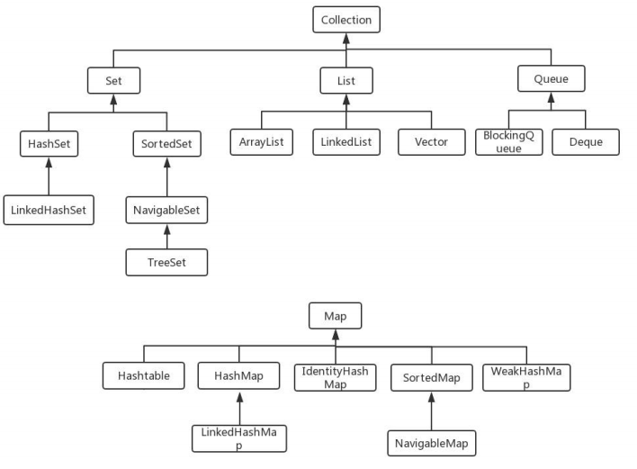

# javaSE内容
1. equals&hashCode？为什么要重写equals？<br>
"=="的作用是判断两个对象的地址是不是相等。即，判断两个对象是不是同一个对象。<br>
基本数据类型==比较的是值，引用数据类型==比较的是内存地址。
"equals()"的作用也是判断两个对象是否相等。<br>
当类没有重写equals()方法，通过equals()比较时等价于"=="比较两个对象；<br>
```java
public class EqualsTest {

    public static void main(String[] args) {
        String a = new String("ab");
        String b = new String("ab");
        String aa = "ab"; //放在常量池中
        String bb = "ab"; //从常量池中查找
        if (aa == bb){ // true
            System.out.println("aa == bb");
        } 
        if (a == b){ // false
            System.out.println("a == b");
        }
        if (a.equals(b)){
            System.out.println("aEQb");
        }
        if (42 == 42.0){ // true
            System.out.println("42 == 42.0");
        }
    }
}
```   
说明：String中的equals方法是被重写过的，因为object的equals方法是比较的对象的内存地址，而String的equals方法比较的是对象的值。<br>
当创建String对象时，虚拟机会在常量池中查找有没有已经存在的值和要创建的指形同的对象，如果有就把它赋值给当前引用。如果没有就在常量池中重新创建一个String对象。

hashCode()的作用是获取哈希码，也称散列码；实际上是返回一个int整数。这个哈希码的作用是确认对象在哈希表中的索引位置。hashCode()方法是Object类中，因此任何类都有hashCode()方法；<br>
散列表存储的是键值对（key-value）,它的特点：能根据键快速的检索出对应的值。<br>
HashSet检查重复对象就用到hashCode：当将对象加入HashSet时，HashSet会计算对象的hashCode值来判断对象加入的位置，同时也会与其他加入对象的hashCode值作比较，如果没有相等hashSet就会假设对象没有重复出现。<br>
如果有相同的hashCode值的对象，这时会调用equals()方法来检查hashCode相等的对象是否真的相等。如果相同，hashSet不会让其添加成功，如果不同会重新散列到其他位置；<br>
**重写equals时必须重写hashcode方法：两个对象有相同的hashCode值，它们也不一定是相等的，因此重写equals方法就必须重写hashCode方法；**

2. hashMap&hashTable？
    1. HashMap是非线程安全的，HashTable是线程安全的；HashTable内部的方法基本都经过Synchronized修饰。
    2. HashMap中key、value都允许为空，但key只能有一个null；HashTable中put进的键值只要有一个null，直接抛空指针异常了。
    3. 初始容量大小和每次扩充容量大小不同：创建时如果不指定容量初始值，HashTable默认的初始大小为11，之后每次扩充，容量变为原来的2n+1；<br>
    HashMap默认初始化为16，之后每次扩充，容量都会变为原来的2倍。<br>
    创建时如果给定了容量初始值，那么HashTable会直接使用给定的初始值，而HashMap会将其扩充为2的幂次方大小。也就是说HashMap总是使用2的幂做为哈希表的大小。
    4. JDK1.8HashMap在解决hash冲突有了改变，当链表长度大于阈值（默认为8）时，将链表转为红黑树，以减少搜索时间。HashTable没有这样的限制。   


3. 扩容怎么实现的？
    

4. currentHashMap？<br>
    JDK1.7的时候，ConcurrentHashMap(分段锁)对整个桶数组进行了分割分段，每一把锁只锁容器中的一部分数据，多线程如果访问不同数据段的数据，就不存在锁竞争，提高并发访问率；
    到了JDK1.8的时候改为synchronized和CAS来操作。
    


5. arrayList&linkedList？
    * 数据结构实现：ArrayList是动态数据数据结构实现的，而LinkedList是双向链表的数据结构；
    * ArrayList比LinkedList在随机访问的时候效率要高，因为LinkedList是线性的数据存储结方式，所以需要移动指针从前往后依次查找；
    * 增加和删除效率：在非首尾的增加和删除操作，LinkedList要比ArrayList效率高，因为ArrayList增删会影响到数组内其他元素的下标；
    * 内存空间占用：LinkedList比ArrayList更占内存，因为LinkedList的节点除了存储数据，还存储了两个引用，一个指向前一个元素，一个指向后一个元素；

6. arrayBlockingQue&linkedBlockingQue？
   * LinkedBlockingQueue和ArrayBlockingQueue都是可阻塞的队列；内部都是使用ReentrantLock和Condition来保证生产和消费的同步；<br>
    当队列为空，消费者线程被阻塞；当队列装满，生产者线程被阻塞；使用Condition方法来同步和通信：await()和signal()；
   * arrayBolockingQue&linkedBolockingQue锁机制不同，LinkedBlockingQueue的锁是分离的，生产者的锁putLock，消费者的锁takeLock；<br>
    而arrayBlockingQue生产者和消费者使用的是同一把锁；
   * LinkedBlockingQueue有默认的容量大小：Integer.MAX_VALUE，当然也可以传入指定容量大小；<br>
    ArrayBlockQueue在初始化的时候，必须传入一个容量大小；
     

7. stringBuffer&stringBuilder？<br>
相同情况下使用StirngBuilder 相比使用StringBuffer 仅能获
得10%~15% 左右的性能提升，但却要冒多线程不安全的风险。

8. java8新特性
   函数式接口：只有一个抽象方法的接口，可以使用@FunctionalInterface注解修饰；
   ```java
   @FunctionalInterface
   public interface MyFunction {
       String getValue(String str);
   }
   ```
   ```java
      /**
      * 定义一个带泛型的函数式接口，T参数，R返回值
      * @param <T>
      * @param <R>
      */
     @FunctionalInterface
     public interface MyFunction2<T,R> {
        R getValue(T t1, T t2);
     }
   ```
   ```java
   public class LambdaTest {
       @Test
       public void testMyFunction(){
           String str = "shq";
           String handlerStr = handlerStr(str, String::toUpperCase);
           System.out.println(str); // shq
           System.out.println(handlerStr); // SHQ
   
           Long handlereLong = handlereLong(1L, 2L, Long::sum);
           System.out.println(handlereLong);
       }
   
       public String handlerStr(String str, MyFunction myFunction){
           return myFunction.getValue(str);
       }
   
       public Long handlereLong(Long a, Long b, MyFunction2<Long,Long> myFunction2){
           return myFunction2.getValue(a,b);
       }
   }
   ```
   java8内置得4大核心函数式接口：<br>
   Consumer<T>：消费型接口 ==> void accept(T t);<br>
   Supplier<T>：供给型接口 ==> T get();<br>
   Function<T, R>：函数型接口 ==> R apply(T t);<br>
   Predicate<T>：断言型接口 ==> boolean test(T t);<br>
   
   
9. 集合和数组的区别？
   * 数组是固定长度的；集合是可变长度的；
   * 数组可以存储基本数据类型，也可以存储引用数据类型；集合只能存储引用数据类型；
   * 数组存储元素必须是同一种数据类型；集合存储对象可以是不同数据类型；
    
   
10. 常用的集合类有哪些？<br>
Map接口和Collection接口是所有集合框架的父接口：
     1. Collection接口的子接口包括：Set接口和List接口；
     2. Map接口的主要实现类有：HashMap,TreeMap,HashTable,ConcurrentHashMap等；
     3. Set接口的实现类主要有：HashSet,TreeSet,LinkedHashSet等；
     4. List接口的实现类主要有：ArrayList,LinkedList,Stack,Vector等；

        
        
11. hashSet的实现原理？<br>
hashSet是基于hashmap实现的，hashSet的元素保存在hashMap的key上，hashMap的value统一为PRESENT;<br>
    
12. jdk动态代理？
    1. JDK的动态代理一定要实现接口；
    2. JDK提供了java.lang.reflect.Proxy类来实现动态代理的，可通过它的newProxyInstance来获得代理实现类；<br>
    Proxy.newProxyInstance(ClassLoader loader, Class<?>[] interfaces, InvocationHandler h)有三个参数，分别是代理类的类加载器，代理类实现的接口(所以jdk动态代理一定要实现接口)，InvocationHandler类，用来是执行invoke方法，可以通过匿名内部类实现；

  

   