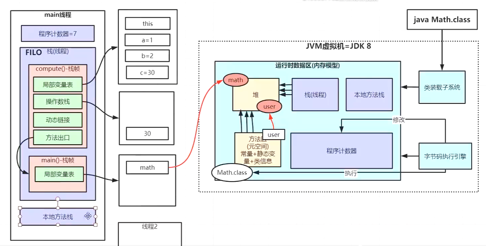

# jvm整理
jvm相关知识点整理

1、.java文件 通过 java c 编译成.class字节码文件；

2、jvm虚拟机组成： 
&emsp;
a、类装载子系统； 
&emsp;
b、运行时数据区； 
&emsp;
c、字节码执行引擎； 
&emsp;
d、本地库接口（JNI,Java Native Interface）； 
&emsp;

##类加载过程
多个java文件经过编译打包生成可运行的jar包，最终由java命令运行到某个主类的main函数启动程序，
这里首先需要通过类加载器把主类加载到jvm。 
主类在运行过程中如果使用到其他类，会逐步加载这些类。 
**jar包不是一次性全部加载的，是使用到时才加载。**

类加载到使用整个过程由如下几步： 
加载 >> 验证 >> 准备 >> 解析>> 初始化 >> 使用 >> 卸载  

加载：在硬盘上查找并通过IO读入字节码文件，使用到类时才会加载，例如：调用类的main()方法，new对象等；

验证：检验字节码文件的正确性；

准备：给类的静态变量分配内存，并赋予默认值；

解析：将符号引用替换为直接引用，该阶段会把一些静态方法替换为指向数据所存内存的指针或句柄，这就是类所谓的静态链接（类加载期间完成）；

初始化：对类的静态变量初始化为指定的值，执行静态代码块；

###类加载器和双亲委派机制
类加载过程主要通过类加载器来实现，java有如下几种类加载器： 
1、启动类加载器（由c++语言实现）：负责加载支撑JVM运行的位于JRE的lib目录下的核心类库，比如rt.jar，charsets.jar等； 
2、扩展类加载器（ExtClassLoader）：负责加载支撑JVM运行的位于JRE的lib目录下的ext扩展目录中的jar类包； 
3、应用程序类加载器（AppClassLoader）：负责加载ClassPath路径下的类包，主要就是加载自己开发的类； 
4、自定义的加载器：负责加载用户自定义路径下的字节码（.class）文件； 

####自定义类加载器
自定义类加载器只需要继承java.lang.Classloader类

####双亲委派机制
加载某个类时会先委托父加载器寻找目标类，找不到再委托上层父加载器加载，如果所有的父加载器在自己的加载类路径下都找不到目标类，则在自己的类加载路径中查找并载入目标类； 
双亲委派机制说简单点：先找到父亲加载，不行再由儿子自己加载；

为什么要设计双亲委派机制？ 
1、沙箱安全机制：自己写的java.lang.String.class类不会被加载，这样便可以防止核心API库被随意篡改； 
2、避免类的重复加载：当父亲已经加载了该类时，就没有必要子ClassLoader再加载一次，保证加载类的唯一性；

##jvm内存结构

运行时数据区分为：方法区（Method Area）、虚拟机栈（java virtual Machine Stacks）、本地方法栈（Native Method Stacks）、
堆（Heap）、程序计数器（The PC Register）；

###栈 线程栈
每当有一个线程，栈内存空间会为这个线程分配一块内存--线程栈，用于存放线程运行中的局部变量；
栈帧：线程栈中，每个方法对应一块栈帧内存区域；
栈帧有四部分组成： 
1. 局部变量表：类似数组的结构，存储方法的局部变量，下标为0的存储的时当前对相的引用this;
2. 操作数栈：栈结构，用于操作数在做运算的过程中临时存放的中转内存空间；如执行int a = 30+10的操作，会先将30和10两个操作数压入操作数栈，运算时将30和10load到cpu寄存器进行运算，得到结果再压入栈，最后出栈赋值给局部变量a;
3. 动态链接：代码指令会加载到方法区中，在程序执行过程中，将符号引用转换为符号对应代码在内存中的地址（直接引用），该地址便存放到动态链接中；
4. 方法出口：记录方法执行结束后，下一步执行的指令位置；

###程序计数器
每个线程独有的内存空间，用于存放程序正在运行的那行代码的内存位置（行号）； 
每执行一行代码，字节码执行引擎会去修改程序计数器； 
CPU失去时间片后，线程挂起，当线程重新获取到时间片后，根据程序计数器记录的位置继续执行；

###本地方法栈
也是每个线程独有的，执行native方法时分配的内存；

###方法区（元空间）
用于存储已被虚拟机加载的类信息、常量、静态变量、即时编译后的代码等数据；

###堆空间

###jvm参数设置

##对象在内存中内存布局

三部分组成：对象头、实例数据、对齐填充；
1. 对象头  8字节的Markword、开启指针压缩后占4字节的ClassPointer类型指针、只有数组对象才有的Length数组长度4字节；
   
   
2. 实例数据 包含了对象的所有成员变量，大小由各个变量类型决定；
3. 对其填充 保证对象时8个字节的整数倍，方便操作系统寻址；

##垃圾回收机制
java中程序不需要显示的去释放一个对象的内存，而是由虚拟机自行执行。在JVM中，有一个垃圾回收线程，是低优先级的，在正常情况下是不会执行的，
只有当虚拟机空闲或当堆内存不足时，才会触发执行，扫到那些没有被任何引用的对象，并将它们添加到要回收的集合中，进行回收。

###minor GC&full GC
minor GC指的是发生在新生代的GC，因为java对象大多是朝生夕死的，所以minor GC非常频繁，一般回收速度也非常快； 
full GC指的是发生在老年代的GC，比minor GC慢上十倍以上；

###对象内存回收
堆中几乎放着所有的对象实例，对堆垃圾回收前的第一步就是要判断哪些对象已经死亡（即不能再被任何途径使用的对象）
####引用计数法：
给对象中添加一个引用计数器，每当有一个地方引用它，计数器就加1；当引用失效，计数器就减1；计数器位0的对象就是不能再被使用的。 
引用计数法实现简单，效率高，但是目前主流的虚拟机中并没有选择这个算法来管理内存，其最主要的原因是它很难解决对象间相互循环引用的问题。两个对象相互引用，导致它们的引用计数器都不为0，于是引用计数算法无法通知GC回收器回收它们。
####可达性分析算法：
将“GC Roots”对象作为起点，从这些节点开始向下搜索引用的对象，找到的对象都标记为非垃圾对象，其于未标记的对象都是垃圾对象； 
GC Roots根节点：线程栈的本地变量、静态变量、本地方法栈的变量等。
####finalize()：
finalize()是Object类中的一个方法，该方法一般由垃圾回收器调用，是回收垃圾对象前的最后判断。

###常见的引用类型
java的引用类型

