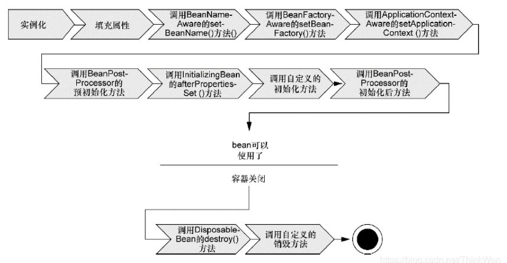

# spring
spring源码学习

1. BeanFactory和ApplicationContext有什么区别？

2. Spring容器中单例bean是线程安全的么？ <br>
   不是，Spring框架中的单例bean不是线程安全的。<br>
   Spring中bean的作用域默认为singleton，单例模式，但Spring并没有对单例bean进行多线程的封装处理；<br>
   实际上大部分时候spring bean都是无状态的（比如dao类），所以某种程度上来说bean也是线程安全的，如果bean有状态的话，就需要开发保证线程安全，可以把bean的作用域定义为
   "prototype"，这样每次从容器中获取bean都会创建一个新的对象进而保证线程安全；<br>
   有状态、无状态要看bean中是否设计的多个线程竞争的临界资源，比如修改一个共享变量；
   
3. Spring bean的生命周期？<br>
   理解Spring bean的生命周期非常重要，因为能够理解spring提供的扩展点来自定义bean的创建过程；
   
   
   spring提供的扩展接口：
   
4. BeanFactory和FactoryBean？<br>
   
5. spring事务？<br>

6. spring常用注解？<br>
   @Conditional：按条件给spring容器注册组件<br>
   @Conditional可以放在类上，也可以放在@Bean方法上；<br>
   @Conditional({Class<? extends Condition>}) 根据Condition类match方法true就向容器注册组件；
   
   
7. 给容器中组成组件的方式？<br>
   1、包扫描+组件标注注解：@Controller/@Repository/@Service/@Component；（只能导入自己定义的组件）<br>
   2、在配置类中使用@Bean注解，可以用于导入第三分包里面的组件；<br>
   3、import导入组件：<br>
      1）、在配置类上使用@Import({xxx.clase})，导入组件，id默认为组件的全类名；<br>
      2）、ImportSelector：返回需要导入组件的全类名数组；<br>
   4、使用Spring提供的FactoryBean（工厂Bean）：spring整合其他框架时会用到FactoryBean方式；
   ```java
      /**
        * 使用Spring提供的FactoryBean（工厂Bean）
      */
     public class PersonFactoryBean implements FactoryBean<Person> {
   
        //返回一个Person对象，会被添加到容器中
        //调用getObject()方法创建Bean
        @Override
        public Person getObject() throws Exception {
           System.out.println("PersonFactoryBean....getObject....");
           return new Person("PersonFactoryBean创建",100);
        }
   
        @Override
        public Class<?> getObjectType() {
            return Person.class;
        }
   
        //控制是否单例
        //true：这个bean是单实例，在容器中保存一份
        //false：多实例，每次获取都会创建一个新的
        @Override
        public boolean isSingleton() {
            return true;
        }
     }
   ```
   

    
   


循环依赖,三级缓存
ioc
aop
声明式事务
事务传播
源码

springboot starter ->源码
bean注入方式
自定义springbootstarter